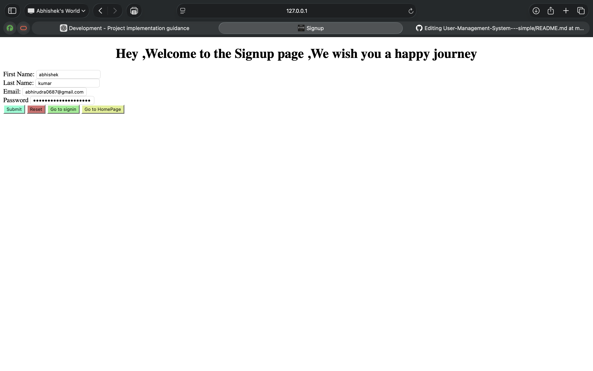
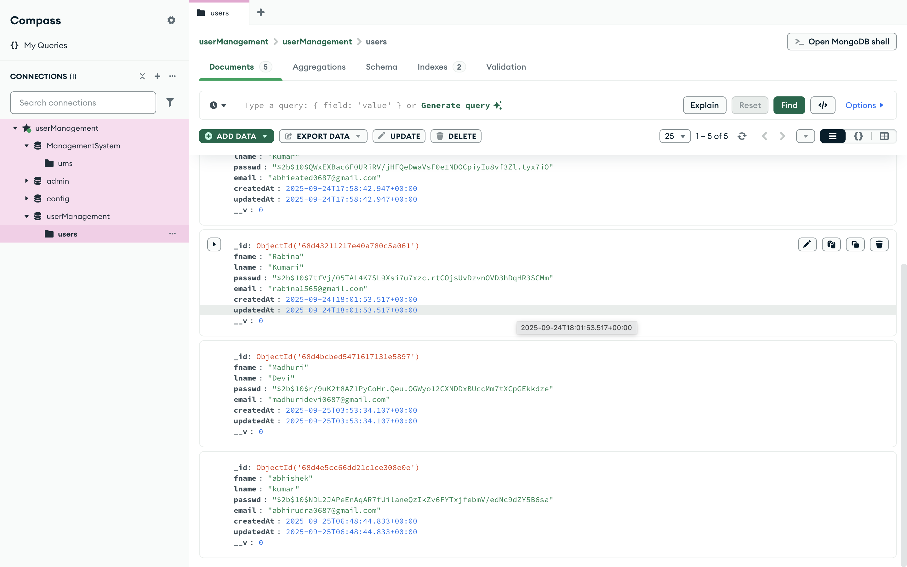
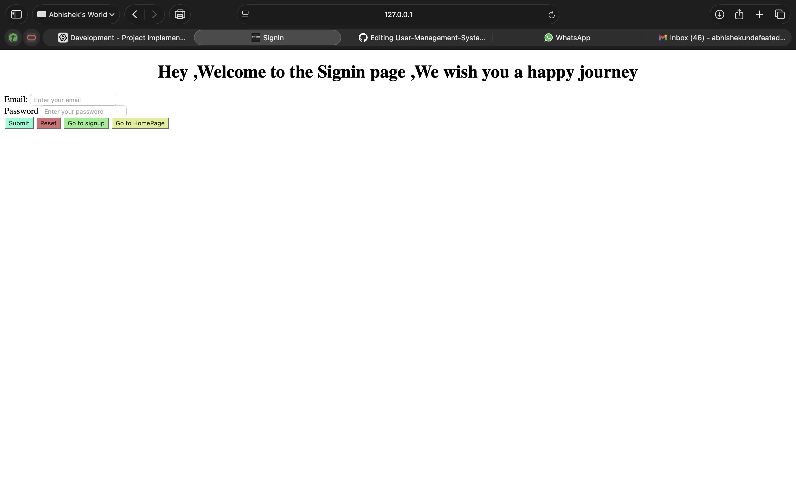
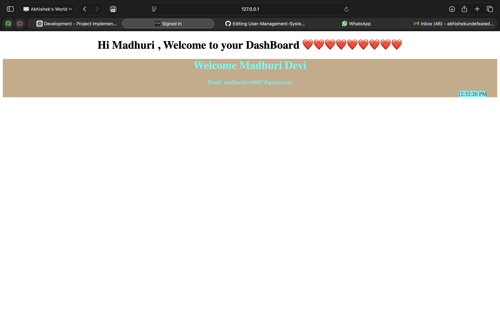

# User Management System (Simple)

A simple user authentication and profile management system built with **Node.js**, **Express**, and **MongoDB**.  
It provides secure user signup, login, and profile access with **JWT authentication**.

---

## 🚀 Features
- User signup with hashed passwords (using `bcryptjs`)
- User login with **JWT-based authentication**
- Protected routes (accessible only with a valid token)
- Profile API endpoint
- Token stored in **localStorage**
- Frontend dashboard that displays:
  - User profile (from backend API)
  - Live updating **timer**

---

## 🛠️ Tech Stack
- **Backend**: Node.js, Express
- **Database**: MongoDB (via Mongoose)
- **Authentication**: JWT + Bcrypt
- **Frontend**: HTML, CSS, JavaScript (Vanilla)

---

## 📂 Project Structure

```
User-Management-System---simple/
│── backend/
│   ├── server.js         # Entry point for Express app
│   ├── models/User.js    # User schema and model
│   ├── routes/auth.js    # Authentication routes (signup, login, profile)
│   └── middleware/auth.js # JWT authentication middleware
│
│── frontend/
│   ├── index.html        # Signup/Login page
│   ├── dashboard.html    # Dashboard with timer + user profile
│   ├── script.js         # Handles signup/login requests
│   └── dashboard.js      # Fetches user profile, updates timer
│
└── README.md
```

## ⚙️ Installation & Setup

### 1️⃣ Clone the repo
```bash
git clone 
cd User-Management-System---simple
```

### 2️⃣ Backend setup
```bash
cd backend
npm install
```

Create a `.env` file inside `backend/`:
```
MONGO_URI=your_mongodb_connection_string
JWT_SECRET=your_secret_key
PORT=3000
```

Start backend:
```bash
node server.js
```

### 3️⃣ Frontend setup
Open `frontend/index.html` in your browser.  

---

## 🔑 API Endpoints

| Method | Endpoint            | Description                  | Protected |
|--------|---------------------|------------------------------|-----------|
| POST   | `/api/auth/signup`  | Register new user            | ❌        |
| POST   | `/api/auth/login`   | Authenticate & get token     | ❌        |
| GET    | `/api/auth/profile` | Fetch logged-in user profile | ✅ (JWT)  |

---

## 🖥️ Demo Walkthrough
1. **Signup** → Register a new user  
2. **Login** → Get token stored in localStorage  
3. **Dashboard** → Access profile + see live timer update  

---

## 📸 Screenshot
#### Home Page of the App

#### Signup Page of the App

#### Database where the records are being saved after signup

#### SignIn Page 

#### DashBoard after user successfully signedin and a toekn is generated



---

## 📌 Future Improvements
- Add role-based access control
- Add email verification
- Add password reset functionality
- Add unit/integration tests

---

## 📝 License
This project is open-source and available under the [MIT License](LICENSE).

